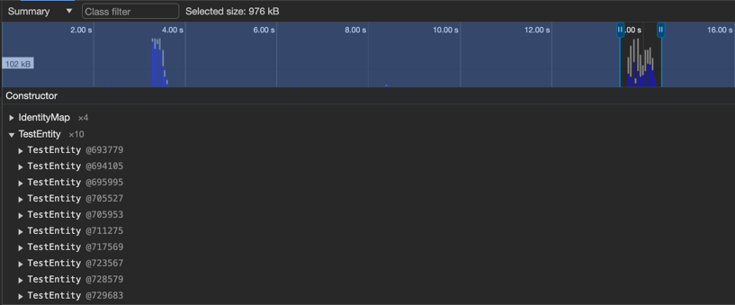
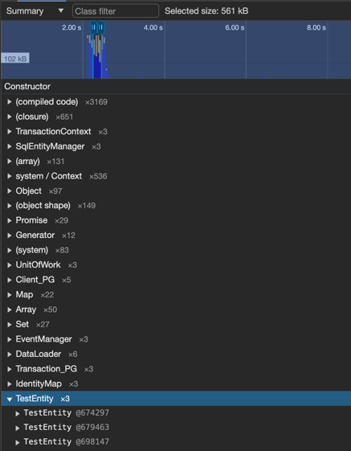

# mikroorm-em-demo

This is a test repository for demonstrating memory leaks into the global EntityManager when using transactions.

## Local development

For local development, it is necessary to execute the following commands:
```bash
npm install
docker-compose up -d --build
npm run orm migration:fresh -- --seed=InitialSeeder
npm run start:debug
```

## How to reproduce the issue

1. After launching NestJS in debug mode, it is necessary to open any Chromium engine-based browser, go to the link `browser://inspect` and open the required debugger;
2. Next, you need to start memory recording while saving the timeline;
3. Then, you need to go to the URL [localhost:3000/update-entities?ids=1,2,3,4,5,6,7,8,9,10](http://localhost:3000/update-entities?ids=1,2,3,4,5,6,7,8,9,10) (you can specify any entity identifiers, by default InitialSeeder creates 150 instances);
4. After completing the update, end the recording, and you will be able to verify that the `TestEntity` is not cleared from memory.

Even with the presence of `em.clear()` on the 27th line in the file `./src/app.service.ts`, TestEntity still remains in memory:



Why am I confident that it is preserved in the global context?

If you insert the clearing of the global context (`this.#em.clear()`) into the body of the `updateEntities` function before starting the transaction, then everything works correctly:





